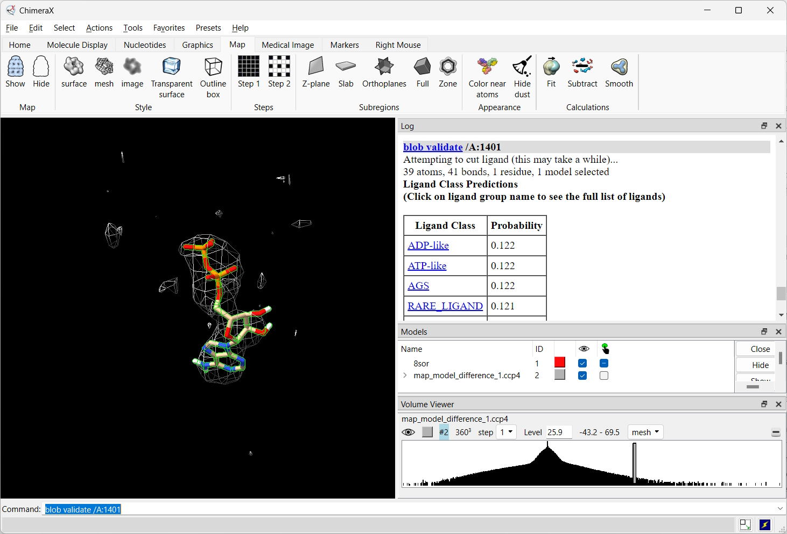

[](https://ligands.cs.put.poznan.pl)
[](https://www.biorxiv.org/content/10.1101/2024.08.27.610022v1)

# ChimeraX LigandRecognizer Bundle

This bundle provides ChimeraX commands for recognizing ligands in cryoEM and X-ray crystallography maps using deep learning. The bundle is accompanying software to the paper "Ligand Identification in CryoEM and X-ray Maps Using Deep Learning" by Karolczak *et al.* To get more information on the reseach behind this tool you can:
- read about the used model on [bioRxiv](https://www.biorxiv.org/content/10.1101/2024.08.27.610022);
- try the [Streamlit demo](https://ligands.cs.put.poznan.pl) to see the model in action;
- find the pretrained model and experiment code at [this GitHub repository](https://github.com/jkarolczak/ligand-classification); 
- get the datasets used for training and testing the model at [Zenodo](https://zenodo.org/records/10908325). 

## Installation

### ChimeraX Toolshed

Coming soon...
<!-- 
To install the ligand recognition tool, run ChimeraX and click *Tools* -> *More Tools...* menu item. In the popup, search for "LigandRecognizer" and click the *Install* button. The tool's commands should now be available in ChimeraX. If this procedure fails, please refer to the manual installation instructions below.
-->

### Manual Installation

You can install the bundle manually by downloading this repository and running the following commands in the repository directory.

**Linux:**
```bash
chimerax --nogui --cmd 'devel build . exit true'
chimerax --nogui --cmd 'devel install . exit true'
```

**Windows:**
```cmd
ChimeraX-console.exe --nogui --cmd "devel build . exit true" 
ChimeraX-console.exe --nogui --cmd "devel install . exit true" 
```

After running the above commands, the `blob validate` and `blob recognize` commands should be available in ChimeraX. You can check it by running 

```shell
help blob
```
in the ChimeraX command line.

## Usage
This tool assumes, that both .pdb/.cif structure and a .ccp4 cryoEM or crystallographic difference map are loaded into ChimeraX (e.g. `open 8SOR/8sor.cif; open 8SOR/map_model_difference_1.ccp4;`). The difference map should be the Fo-Fc map for X-ray crystallography
and for cryoEM it should be the result of PHENIX's `phenix.real_space_diff_map "$MODEL" "$MAP" "resolution=$RES" command`. To obtain the cryoEM difference map, you can use the `computeMapModelDifference.sh` script available in this repository. With the partial model and difference map opened, within ChimeraX you can run the commands presented below to validate an existing ligand or to predict a ligand matching a selected map fragment.

The tool implements two basic commands:
1. `blob validate res_id [map_id] [structure_id] [xray False/True]`: validates (performs a prediction for) an existing ligand at res_id.
2. `blob recognize [map_id] [surface_id] [xray False/True]`: recognizes (performs a prediction for) a ligand in a selected map fragment.

All the parameters in brackets are optional and if they are not provided the command will use the currently active map, structure, surface, and assume that the map is a cryoEM map (xray False). The above two commands are aliases for `blobus validatus` and `blobus recognitus`, respectively.
    
Examples:
- `blob validate /A:1401` (validates a ligand at residue 1401 in chain A using the default map and structure);
- `blob recognize #2 #4.1` (recognize a ligand using map #2 and a user-selected surface (cropped map fragment) #4.1);
- `blob validate /A:1401 xray True` (validates a ligand at residue 1401 in chain A using the default map and structure and treat the map as an X-ray difference map).

The tool will output the top 10 predicted ligand names and their confidence scores in ChimeraX log window. The confidence score is a value between 0 and 1, where 1 means that the model is certain of a given ligand type. The ligands are grouped and named by their PDB ligand identifiers, e.g. "ATP" or "ADP". Ypu can click on the ligand group name to see the names of the ligands in the group.



## Citation
```bibtex
@article {LigandDeepLearning,
	author = {Karolczak, Jacek and Przyby{\l}owska, Anna and Szewczyk, Konrad and Taisner, Witold and Heumann, John M. and Stowell, Michael H.B. and Nowicki, Micha{\l} and Brzezinski, Dariusz},
	title = {Ligand Identification using Deep Learning},
	year = {2024},
	doi = {10.1101/2024.08.27.610022},
	journal = {bioRxiv}
}
```
